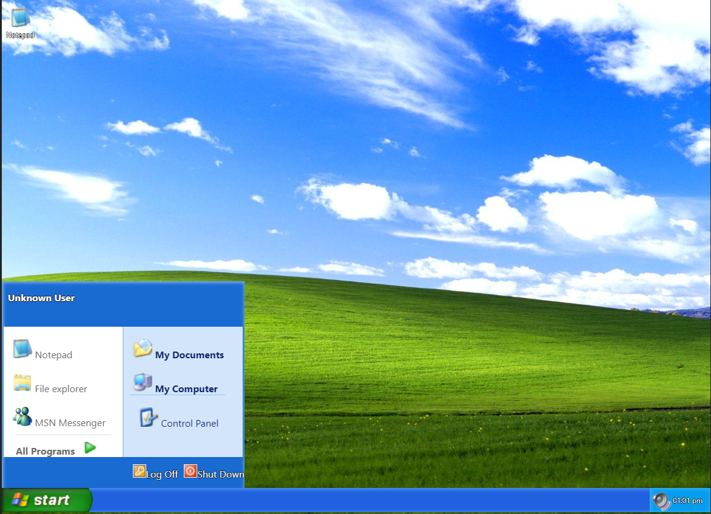

# FakeOS - A mock Windows XP Website

## Demo & Snippets

- 

---

## Requirements / Purpose

### Overview:

- The goal of this project is to have students explore and consolidate their understandings of HTML, CSS and JavaScript. This project will require you to replicate the layout and format of a design/image using CSS, add content via HTML and control the interactive elements via JavaScript.
  The design is going to be that of an operating system.
  Please look at the provided image gallery for examples. You should choose either a portrait (mobile) or landscape (desktop) operating system, you are not expected to create a responsive page that works on both, however it should look good on the chosen orientation at different resolutions/ratios. You will select one of the provided images, or your own as approved by a coach.

- Features
  - You will be creating an SPA (Single Page Application)
  - Desktop has a wallpaper that fits the viewport
  - There will be selectable icons
  - Selecting an icon will open an "app", creating a modal to display some content
  - Able to close an app
  - There will be a selectable menu
  - Selecting the menu will display a list of text and icons
  - The current time is displayed somewhere

### MVP's

- HTML/SCSS
  - Wallpaper scales to fit the viewport
  - Minimum 1 icon on desktop
  - The menu is positioned in the appropriate place (bottom left on windows, top of the screen on android)
  - Apps look consistent
  - Menu contains a flex with content inside it
  - Apps should be able to contain text, an image or a form
  - JavaScript
  - Put your js code into separate files
  - Your icons and menu should add event listener for the click event, don't use the html onclick attribute
  - Give your functions and variables good names
  - Use the arrow syntax to declare functions

---

## Build Steps

- Use Liveserver extension to run project

---

## Design Goals / Approach

- One of the given templates was a Windows XP operating system, which mainly uses the start menu instead of apps on the desktop. Visually, I tried to make it look as close to Windows XP as possible. Attempting to use all the colour schemes, fonts, font sizes, etc. While this was hard at first, it became easier as I developed. The hardest part was finding the correct icons and making them usable for this project.
- After this, I started working on the DOM manipulation. I first started with generating the apps, such as a notepad, and the time. These were relatively easily to implement. Then I went for the start menu, as this would be the hardest part. At first I struggled, then after a few tips from some coaches I managed to get this done relatively quickly.
- I developed this way because breaking a larger project into smaller, more manageable bits makes development much easier. Doing the aesthetics first meant that I could solely focus on the DOM later, and further break those steps down.

---

## Features

- A current time, which constantly changes to the correct current time.
- A start menu
- A notepad app
- The My Documents and My Computer go to little easter eggs.

---

## Known issues

- My Documents/My Computer has some weird display issues when clicking - FIXED
- The 'loading' of apps is a bit buggy sometimes, and either doesn't close down previous app or weirdly overlays it.

---

## Future Goals

- If I had more time, I would like to mock the MSN Messenger app. I had a few plans for this in development, but time constraints and personal events that were going on at the time restricted this for me.

---

## Change logs

-

### 21/11/2023 - Fixed My Computer/Documents white space

- Previously there was a space between the settings that the actual text area, this was fixed by changing some padding/margin and height/width settings within the div.

---

## What did you struggle with?

- I struggled at first understanding DOM manipulation, and was finding it hard to set aside time for this project. However, eventually as I broke the project up it became more manageable. Starting with the easier DOM parts of the project helped me "upskill" and understand more of the manipulation I was needing to do and this helped for the harder parts of the project.

---
